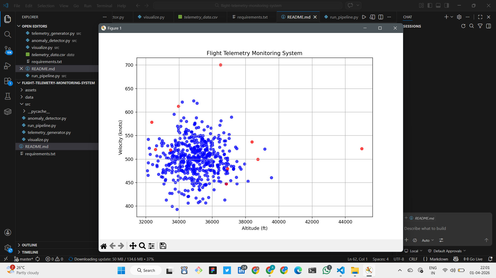

# AeroStream – Aerospace Telemetry Analytics & Anomaly Detection Platform

AeroStream is a telemetry analytics platform that simulates aircraft sensor data, monitors flight parameters, and identifies abnormal operating conditions using machine learning-based anomaly detection techniques.

## Overview

Modern aircraft generate large volumes of telemetry data from onboard sensors. Monitoring these signals is critical for identifying abnormal behaviour, detecting potential system failures, and supporting operational decision-making.

AeroStream implements an end-to-end telemetry analytics pipeline that processes simulated aircraft telemetry data and applies machine learning techniques to detect anomalous flight conditions.

## Key Features

* Synthetic aircraft telemetry generation
* Telemetry data preprocessing and analysis
* Anomaly detection using Isolation Forest
* Flight parameter monitoring and visualization
* Detection of abnormal aircraft operating conditions
* Telemetry trend analysis through interactive plots

## Telemetry Parameters

The system analyzes multiple aircraft telemetry signals, including:

* Altitude
* Velocity
* Temperature
* Latitude
* Longitude

These parameters represent common telemetry measurements used for flight monitoring and operational analysis.

## Technical Approach

AeroStream generates simulated telemetry streams, processes sensor measurements, and applies the Isolation Forest anomaly detection algorithm to identify unusual patterns in aircraft behaviour. Detected anomalies are highlighted through data visualizations, enabling efficient monitoring and analysis.

## Technologies Used

* Python
* Pandas
* NumPy
* Scikit-learn
* Matplotlib

## Project Structure

* `telemetry_generator.py` – Synthetic telemetry generation
* `anomaly_detector.py` – Isolation Forest anomaly detection
* `visualize.py` – Telemetry visualization
* `run_pipeline.py` – End-to-end analytics pipeline
* `telemetry_data.csv` – Sample telemetry dataset
* `requirements.txt` – Project dependencies

## Getting Started

Install dependencies:

```bash
pip install -r requirements.txt
```

Run the telemetry analytics pipeline:

```bash
python run_pipeline.py
```

## Sample Output

The system identifies abnormal telemetry readings and visualizes detected anomalies.

* Normal telemetry behaviour
* Anomalous telemetry behaviour
* Flight trend visualization
* Sensor pattern analysis



## Potential Applications

* Aerospace telemetry monitoring
* Predictive maintenance support
* Flight operations analytics
* Sensor anomaly detection
* Safety monitoring systems

## Future Enhancements

* Real-time telemetry stream ingestion
* Live monitoring dashboards
* Automated anomaly alerting
* Integration with real-world telemetry datasets
* Advanced predictive analytics models

## Author

**Aishwarya S Ningappanavar**

B.E. Electronics and Communication Engineering
Nitte Meenakshi Institute of Technology (NMIT), Bengaluru

* GitHub: https://github.com/aishwarya-15sn
* LinkedIn: https://www.linkedin.com/in/snaishwarya
